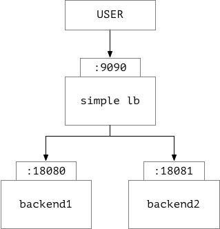

# simple load balancer




The project include,

1. lb - load balancer
    - accept backend server register and remove outdate service
    - use **HTTP redirect** to implement load balancer

2. server - backend server
    - register status to load-balancer
    - send heartbeat to load-balancer


## run and test

1. start lb

```bash
cd lb

go run main.go
```

2. start backend server


```bash
cd server

# port is backend listen port
# lb is load balancer listen port, for register server
go run main.go -port=":18080" -lb=":9090"

# ... maybe run the second backend server
# listen port is different in one host
go run main.go -port=:18081 -lb=":9090"
```


3. test

```bash

curl http://localhost:9090
# server-:18080

curl -L http://localhost:9090
# server-:18081
```

